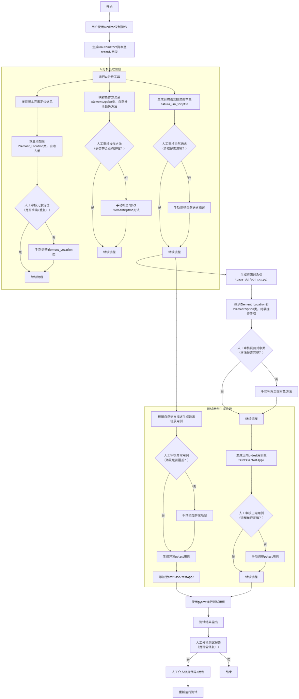

# APP UI自动化框架

本框架基于weditor录制，生成uiautomator2格式的自动化脚本，并通过AI分析自动生成可维护的自动化代码。所有自动化流程均通过提示词工程（Prompt Engineering）驱动AI自动执行，适用于Android APP的UI自动化测试。




## 项目结构

```
c:\Users\Administrator\Desktop\APP_UI_AUTO\
│
├── record\                # 存放weditor录制生成的原始uiautomator2脚本（如xxx.py）
├── page_obj\              # 存放自动生成的页面对象类（如obj_xxx.py）
├── element_location.py    # 元素定位类，统一管理所有页面元素定位
├── element_option.py      # 元素操作类，封装常用操作方法
├── testCase\
│   └── testApp\
│       └── test_obj_xxx.py  # pytest测试用例
├── nature_lan_scripts\        # 存放自动生成的自然语言描述脚本（如nature_xxx.py），含正向与异常用例
├── README.md
└── ...
```
## 分层设计架构与POM模式

本框架采用分层设计架构，结合POM（Page Object Model，页面对象模型）模式，提升自动化测试的可维护性和可扩展性。

- **分层设计**：
  - 元素定位层（element_location.py）：统一管理所有页面元素的定位信息。
  - 元素操作层（element_option.py）：封装通用的元素操作方法。
  - 页面对象层（page_obj/obj_xxx.py）：每个页面或功能对应一个对象类，继承元素定位和操作层，将业务操作步骤方法化。
  - 测试用例层（testCase/testApp/）：组织具体的pytest测试用例，调用页面对象类实现业务流程测试。


- **POM模式**：
  - 每个页面或功能模块对应一个页面对象类，页面元素和操作分离，测试用例只关注业务流程调用，降低维护成本。

## 主要类说明

- **Element_Location**  
  统一管理所有页面的元素定位信息，支持增量添加，添加后自动去重，确保唯一性。

- **ElementOption**  
  封装常用的元素操作方法，如点击、输入、滑动等。

- **obj_xxx**  
  针对每个页面/功能自动生成的对象类，继承自`Element_Location`和`ElementOption`，将操作步骤方法化。

## 使用说明

1. 使用weditor录制操作，生成uiautomator2脚本至`record/`目录。
2. 运行AI分析工具，自动提取元素定位、生成页面对象类和测试用例。
3. 在pytest环境下运行`testCase/testApp/`下的测试用例文件。

## 自动化流程


1. **录制操作**：通过运行`record/record_login.py`开启录制，生成uiautomator2格式的自动化脚本。

**说明：** 以下所有流程均通过提示词工程（Prompt Engineering）驱动AI自动完成，无需手动编写脚本。**在使用提示词工程时，请将提示词中的文件名或方法名修改为你实际想要操作的名字，以确保生成的代码符合你的需求。**

2. **元素定位提取与管理**
   - 从`record/record_xxx.py`中提取所有元素定位信息。
   - 以`logout_text = {"text":"logout","resourceId":"{}:id/tv_first_level_title".format(packagename)}`的格式组织。
   - 将这些元素定位信息增量地添加进`Element_Location`类，添加后进行去重，确保所有元素定位唯一且无重复，便于统一管理和复用。

3. **元素操作方法映射与补全**：将录制脚本中的元素操作与ElementOption类中已定义的方法进行映射，自动检查ElementOption类是否包含所有所需的预定义方法，如有缺失则自动发现并补全缺失的方法，确保操作方法的完整性和一致性。

4. **步骤分析与自然语言描述**
   - 分析如`record_xxx.py`等脚本内容，自动生成自然语言描述的测试步骤`nature_xxx.py`，并将该文件放在`nature_lan_scripts`文件夹下，便于理解和维护。

5. **页面对象类自动生成**
   - **类的创建**：在`page_obj`目录下创建如`obj_xxx.py`的新文件，新建`obj_xxx`类，继承自`Element_Location`和`ElementOption`。
   - **方法的添加**：将`record/record_xxx.py`中的操作步骤封装为`obj_xxx`类中的方法，添加方法时，直接将record_xxx.py的步骤封装为类中的方法，元素定位和操作分别调用父类方法。

6. **pytest测试用例生成**
   - **新建测试用例文件**：在`testCase/testApp/`目录下创建如`test_obj_xxx.py`的新文件。
   - **添加测试用例**：将需要测试的流程或方法，逐步封装为`test_obj_xxx.py`中的pytest测试方法，实现对`obj_xxx`类xxx方法的基本流程测试。

7. **异常场景测试用例生成**
   - **自然语言用例生成**：根据`nature_xxx.py`中的自然语言描述，自动生成异常场景的自然语言测试用例，异常用例的步骤参照正向用例，补充在该文档中，并按照顺序组织起来，提升测试覆盖率和健壮性。
   
   - **pytest用例生成**：根据`nature_xxx.py`中的异常测试用例，自动生成对应的pytest方法，并添加到`testCase/testApp/test_obj_xxx.py`中。所有元素定位和操作方法均调用`page_obj/obj_xxx.py`中的内容，实现异常场景的自动化验证。


